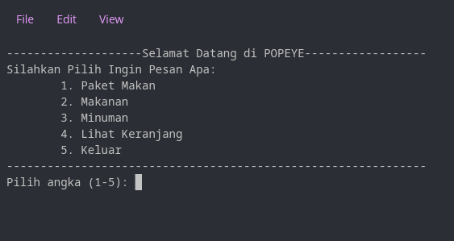
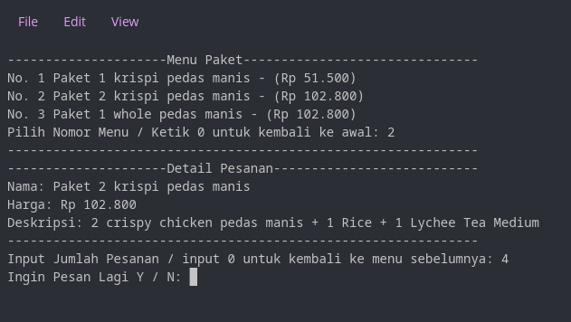
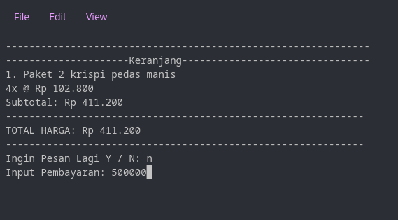
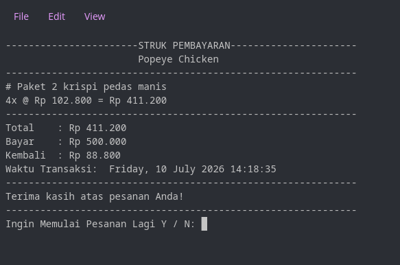

# 🍗 Popeye’s CLI – Aplikasi Pemesanan Makanan

Aplikasi CLI (Command Line Interface) sederhana berbasis Go untuk simulasi pemesanan menu makanan, minuman, dan paket, dengan fitur keranjang belanja serta perhitungan total harga. Data menu disimpan dalam file `menu.json` dan di-*embed* langsung ke dalam binary menggunakan fitur `//go:embed`, sehingga mudah dijalankan tanpa membawa file terpisah.

---

## ✨ Fitur Utama

- Menampilkan daftar menu berdasarkan kategori (Paket, Makanan, Minuman)
- Filter menu berdasarkan nama atau kategori
- Menambahkan item ke keranjang belanja
- Menampilkan isi keranjang dan total harga
- Menghapus item dari keranjang
- Proses pembayaran dengan output rupiah yang diformat
- Tampilan layar dibersihkan setiap pergantian menu (cross-platform)
- Data menu di-*embed* dalam binary – siap pakai di komputer manapun

---

## 📁 Struktur Proyek
```sh
├── .github/workflows/ # (opsional) untuk CI/CD
│ └── action.yml
├── feature/ # Paket berisi logika fitur aplikasi
│ ├── cart.go # Manajemen keranjang (tambah, hapus, lihat)
│ ├── detailmenu.go # Menampilkan detail menu
│ ├── filternenu.go # Filter menu berdasarkan kriteria
│ ├── formatrupaigho.go # Format angka ke mata uang Rupiah
│ └── payment.go # Proses pembayaran
├── menu/ # Paket untuk data menu
│ ├── menu.go # Definisi struct Menu dan fungsi ListMenu
│ └── utils/ # Fungsi utilitas pendukung
├── go.mod # Modul Go
├── main.go # Entry point aplikasi
├── menu.json # File data menu (di-embed)
├── Dockerfile # (opsional) untuk containerisasi
├── LICENSE # Lisensi proyek
├── program # Binary hasil build (jika ada)
├── clearscreen.go # Fungsi bersihkan layar (cross-platform)
└── README.md # Dokumentasi ini
```

## 🚀 Cara Menjalankan

### Prasyarat
- Go versi 1.16 atau lebih baru (karena menggunakan `//go:embed`)
- Terminal / command prompt

### Jalankan secara langsung (tanpa build)
```bash
go mod tidy
go run main.go
```

## ⚙️ Otomatisasi Build Multi-Platform & Docker (CI/CD)

Proyek ini dilengkapi dengan **GitHub Actions** yang secara otomatis melakukan build dan rilis ketika Anda melakukan **push tag baru** (misalnya `v1.0.0`).

### Apa yang terjadi saat push tag?
1. **Build Binary** untuk 3 platform sekaligus:
   - 🐧 **Linux** (amd64)
   - 🍎 **macOS** (arm64)
   - 🪟 **Windows** (amd64)

2. **Build Docker Image** dan push ke **GitHub Container Registry (GHCR)** atau Docker Hub.

3. **Buat GitHub Release** secara otomatis, lengkap dengan file binary hasil build sebagai lampiran (*assets*).

Anda bisa lihat aplikasi binary di bagian release, pilih sesuai platfrom OS yang anda gunakan, yang paling update, untuk menjalankan Aplikasi Binnary.

### Cara memicu otomatisasi:
```bash
git tag v1.0.0
git push origin v1.0.0
```

## 🐳 Jalankan dengan docker image
Jika anda ingin langsung menjalankan aplikasi dengan container, bisa gunakan docker untuk menjalankan aplikasi, pastikan sudah install docker di peranhgkat anda
```bash
docker pull ghcr.io/username/popeye-cli:latest
docker run -it ghcr.io/username/popeye-cli:latest
```

## 🧮 Screenshot Aplikasi dan Hasil Struk

| Tampilan Awal | Pilih Menu & Input QTY  | Keranjang & input Pembayaran | Struk Pembelanjaan |
| :---: | :---: | :---: | :---: |
|  |  |  |  |

## 👨‍💻 Author

- GitHub: https://github.com/dimastadeoo
- Repository: https://github.com/dimastadeoo/koda-b8-weekly3

## 📄 License
This project is licensed under the MIT License.


